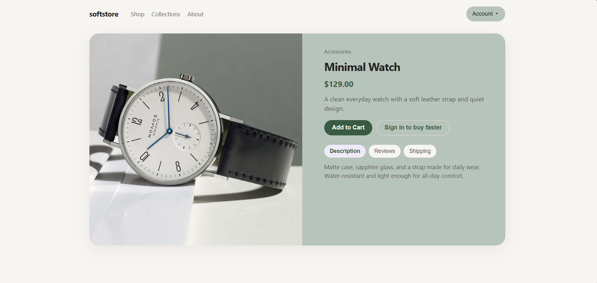
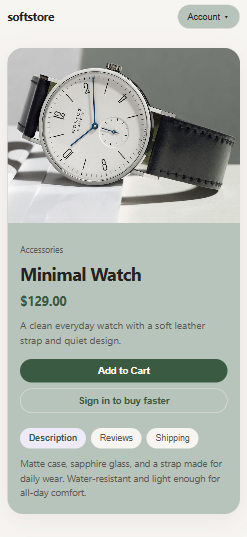

# Soft Store

A responsive product page for a watch store built with **HTML, CSS, and JavaScript**.

The project focuses on interactive UI components such as tabs, dropdown menus, and a login modal.

## ✨ Features

* Product details and pricing
* Account dropdown menu
* Product tabs for:

  * Description
  * Reviews
  * Shipping
* Login modal
* Open and close modal interactions
* Close modal by clicking outside or pressing `Escape`
* Responsive layout for mobile and desktop
* Interactive buttons and UI elements

## 🧩 JavaScript Concepts

This project uses several JavaScript concepts for handling user interactions:

* **classList** for adding and removing active states
* **Event Delegation** for handling dropdown menu items and product tabs
* **Tabs** for switching between product information panels
* **Modal** for the sign-in form
* **Dropdown** for the account menu
* `data-*` attributes for connecting tabs and dropdown actions
* DOM manipulation and event listeners

## 🛠️ Built With

* HTML5
* CSS3
* JavaScript
* CSS Variables
* DOM Manipulation
* Event Listeners
* Event Delegation
* Responsive Design

## 📸 Screenshots

### 🖥️ Desktop




### 📱 Mobile




## 🌐 Live Demo


[View Live Demo](https://elenahedayat.github.io/soft-store/)

## 📁 Project Structure

```text id="q8r2ma"
soft-store/
│
├── image.png
├── index.html
├── style.css
├── script.js
└── README.md
```

## 🚀 How to Run

1. Clone the repository:

```bash id="n4d7xp"
git clone https://github.com/elenahedayat/soft-store.git
```

2. Open the project folder.
3. Open `index.html` in your browser.

No additional installation or dependencies are required.

## 👩‍💻 Author

**Elena Hedayat**

[GitHub](https://github.com/elenahedayat)
